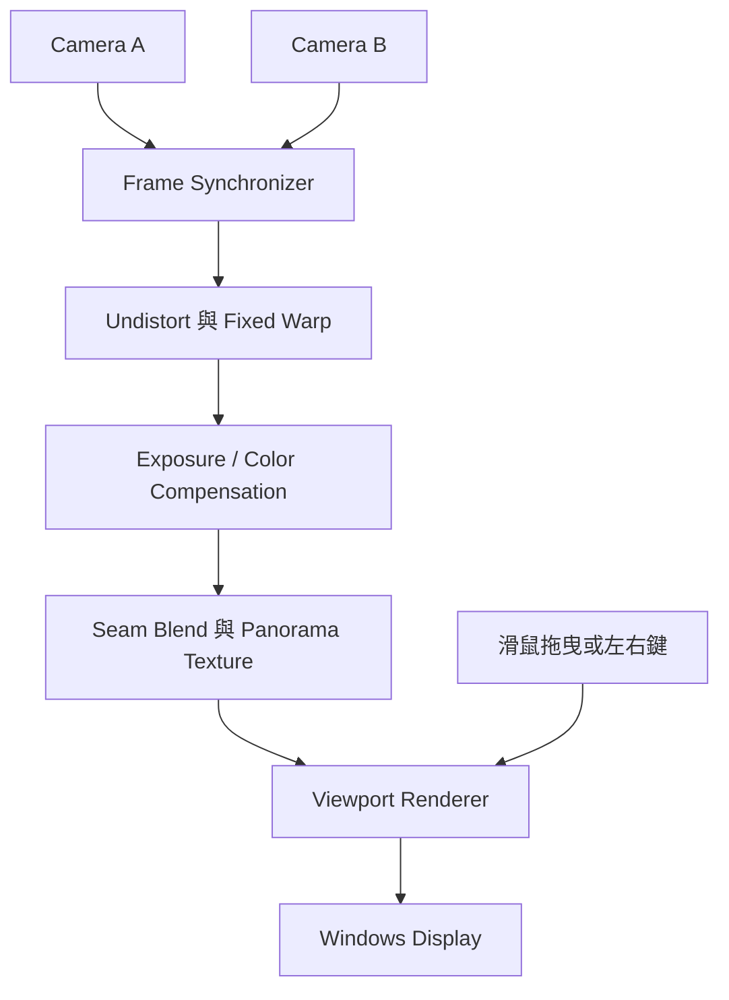

# ClassVista：雙攝影機即時全景與可移動 Viewport MVP 執行計畫

| 專案識別 | 名稱 |
|---|---|
| 專案名稱 | **ClassVista** |
| 中文名稱 | 課堂全景視界 |
| Git Repository | `classvista` |
| Solution | `ClassVista.sln` |
| Root Namespace | `ClassVista` |

## 1. 專案目標

建立一套在 Windows 本機執行的 MVP：同時擷取兩台固定式攝影機的影像，經校正、固定幾何轉換與接縫融合後，產生即時超寬全景畫面；使用者可透過滑鼠拖曳或鍵盤左右鍵，選擇全景中的觀看區域。

本計畫驗證的核心價值是：

1. 兩路 1080p/30 FPS 影像能穩定同步擷取。
2. 在室內課堂、主要物體距離 5 公尺以上的環境中，可產生連續且品質可接受的全景。
3. 使用者可流暢地左右移動 1920×1080 Viewport。
4. 系統架構不寫死攝影機數量，後續可擴充至 3 台以上。

## 2. 基準規格與假設

| 項目 | MVP 基準 |
|---|---|
| 攝影機數量 | 2 台，軟體保留 N 台擴充能力 |
| 攝影機型式 | 兩台完全相同型號的 USB Camera |
| 輸入規格 | 每台 1920×1080、30 FPS |
| 安裝方式 | 固定在同一剛性支架，鏡頭盡量靠近，分別朝左、右 |
| 畫面重疊 | 相鄰畫面約 20～25% |
| 拍攝環境 | 室內課堂，主要物體距離 5 公尺以上 |
| 同步方式 | 軟體時間戳同步；MVP 不使用 Hardware Sync |
| 攝影機控制 | 固定 Exposure、White Balance 與 Focus |
| 處理平台 | Windows 本機 PC |
| 開發技術 | C#、目前受支援的 .NET LTS、OpenCvSharp/OpenCV |
| 顯示方式 | Windows 桌面應用程式，本機螢幕 |
| Viewport | 1920×1080，僅水平 Pan |
| 效能目標 | 30 FPS；端對端延遲不超過 200 ms |
| MVP 不包含 | 遠端串流、錄影、音訊、Zoom、自動追蹤、3D 視角重建 |

> 時程估算以 1 位熟悉 C#/.NET 的開發者全職投入為前提；採購與硬體到貨時間不計入。

## 3. 系統架構

### 3.1 執行時資料流

1. 每台 Camera 由獨立擷取工作執行，Frame 寫入有上限的佇列；滿載時丟棄舊 Frame，避免延遲持續累積。
2. Frame Synchronizer 以單調時鐘時間戳選擇最接近的一組影格，並記錄兩路影格時間差。
3. 套用預先建立的 Undistort Map 與固定 Warp Map，不在每一幀重新執行 Feature Matching。
4. 依校正結果執行亮度、色彩補償及固定或預先計算的 Seam Blend。
5. 將結果寫入 Panorama Buffer，再由 Renderer 依 `viewportX` 裁切顯示。
6. UI 執行緒只負責輸入及呈現；擷取與影像處理不可阻塞 UI。

### 3.2 建議的程式模組

| 模組 | 職責 |
|---|---|
| `ClassVista.Camera.Abstractions` | Camera、Frame、時間戳與設定介面；避免綁死兩台攝影機 |
| `ClassVista.Camera.Windows` | Windows/Media Foundation 或 OpenCV Capture 實作 |
| `ClassVista.FrameSync` | 多路 Frame Queue、配對、逾時及 Drop Policy |
| `ClassVista.Calibration` | Intrinsic Calibration、Homography/Warp、設定檔存取 |
| `ClassVista.Panorama.Core` | Undistort、Warp、Color Compensation、Blend |
| `ClassVista.App` | Viewport、使用者輸入、狀態顯示與錯誤處理 |
| `ClassVista.Diagnostics` | FPS、延遲、同步差、丟幀率與處理階段耗時 |

## 4. 執行階段與工作分解

### Phase 0：規格凍結與測試環境（1～2 人日）

- [ ] 確認兩台 Camera 型號、可用輸出格式、FOV 與驅動程式。
- [ ] 確認兩台 Camera 能否分別鎖定 Exposure、White Balance、Focus。
- [ ] 確認目標 PC 的 CPU、GPU、USB 控制器與顯示解析度。
- [ ] 建立代表性課堂測試場景：距離標記、固定參考物、人物移動路徑。
- [ ] 建立效能量測欄位與測試紀錄格式。

**交付物**

- 硬體與環境清單。
- Camera 能力矩陣。
- 已確認的 MVP 規格與例外條件。

**階段閘門 G0**

- 兩台 Camera 可由同一台 Windows PC 同時辨識，且能選擇 1080p/30 FPS 模式。

### Phase 1：雙路取像技術驗證（2～3 人日）

- [ ] 實作可列出 Camera、選擇裝置及設定格式的最小程式。
- [ ] 同時擷取兩路 1080p/30 FPS，顯示獨立預覽。
- [ ] 對每個 Frame 記錄擷取時間戳、序號與到達時間。
- [ ] 實作 bounded queue 與「丟舊保新」策略。
- [ ] 量測 USB 頻寬、CPU 使用率、FPS、Dropped Frames 與延遲。
- [ ] 驗證 MJPEG、YUY2 等 Camera 格式，選出品質與頻寬最合適的組合。
- [ ] 實作 Camera 中斷偵測與重新連線的最小流程。

**交付物**

- 雙路取像 Prototype。
- 30 分鐘穩定性與效能報告。

**階段閘門 G1**

- 兩路可連續運作 30 分鐘且不當機。
- 每路平均擷取幀率至少 28 FPS，丟幀率低於 1%。
- 延遲不會隨執行時間持續累積。

> 若 G1 未通過，優先調整 Camera 輸出格式、解析度或分配到不同 USB Host Controller；在取像穩定前不進入拼接實作。

### Phase 2：安裝、鏡頭與空間校正（3～4 人日）

- [ ] 製作或取得剛性雙 Camera 支架，確保安裝後不會位移。
- [ ] 將兩個鏡頭盡量靠近，調整方向使重疊率約為 20～25%。
- [ ] 使用 Chessboard 或 ChArUco 分別完成兩台 Camera 的 Intrinsic Calibration。
- [ ] 產生並保存每台 Camera 的 Undistort Map。
- [ ] 使用代表性課堂場景建立固定 Homography 或投影轉換。
- [ ] 比較平面投影與圓柱投影，選擇直線變形與接縫較佳者。
- [ ] 產生固定 Warp Map、有效像素 Mask、裁切邊界與初始 Seam Mask。
- [ ] 定義 Calibration Profile 格式，包含 Camera 識別、解析度、矩陣與版本。
- [ ] 實作啟動時的 Profile 相容性檢查；Camera、解析度或支架變更時要求重新校正。

**交付物**

- Calibration 工具與操作說明。
- 可重複載入的 Calibration Profile。
- 靜態雙畫面拼接樣本與品質比較紀錄。

**階段閘門 G2**

- 靜態場景主要結構可正確對齊。
- 校正結果在應用程式重啟後可重複使用，不必重新 Feature Matching。
- Panorama 有效區域足以容納 1920×1080 Viewport 的水平移動範圍。

### Phase 3：即時拼接核心（4～6 人日）

- [ ] 實作軟體 Frame Synchronizer 與最大等待時間。
- [ ] 以預先計算的 Map 執行 Undistort 與 Warp。
- [ ] 實作亮度與色彩增益補償；優先使用低頻、緩慢更新，避免畫面閃爍。
- [ ] 實作固定 Feather Blend；若品質不足，再評估 Multi-band Blend。
- [ ] 預配置處理 Buffer，避免每幀配置大型物件。
- [ ] 建立擷取、處理與顯示 Pipeline，避免單一慢幀阻塞後續影格。
- [ ] 顯示 FPS、兩路同步差、處理延遲與 Drop Count 等診斷資訊。
- [ ] 加入 Calibration Profile 缺失、Camera 格式錯誤及裝置中斷的明確錯誤訊息。

**交付物**

- 即時 Panorama Pipeline。
- 效能與延遲量測結果。

**階段閘門 G3**

- 1080p/30 FPS 雙路輸入下，Panorama 平均輸出至少 28 FPS。
- 端對端延遲不超過 200 ms，且長時間運作不持續增長。
- 影格配對時間差 P95 不超過 33 ms，並能在 UI 中觀察。

### Phase 4：Viewport 與使用者介面（2～3 人日）

- [ ] 顯示 1920×1080 Viewport，而非強制縮放完整 Panorama。
- [ ] 實作滑鼠按住拖曳的水平 Pan。
- [ ] 實作鍵盤 `←`、`→` 移動。
- [ ] 限制 `viewportX` 範圍，避免超出 Panorama 有效邊界。
- [ ] 對輸入做平滑處理，避免跳動；拖曳時立即更新。
- [ ] 提供「回到中央」操作。
- [ ] 顯示 Camera/校正狀態，並提供診斷資訊開關。

**交付物**

- 可操作的 Windows MVP 應用程式。

**階段閘門 G4**

- 使用者可從全景最左端平滑移動到最右端。
- Viewport 移動不影響 Camera 擷取及拼接幀率。
- 不顯示無效黑邊或超出有效 Panorama 區域。

### Phase 5：課堂場域品質調校（3～5 人日）

- [ ] 在實際教室固定 Camera，重新完成最終 Calibration。
- [ ] 以距離 5、7、10 公尺的固定物與移動人物測試接縫。
- [ ] 測試人物從左至右、右至左穿越 Seam 的情況。
- [ ] 在不同教室照明條件下測試曝光與色彩一致性。
- [ ] 依台灣常見 60 Hz 電源環境調整快門，降低 LED/日光燈閃爍風險。
- [ ] 比較 Feather 與 Multi-band Blend 的品質、延遲及 CPU/GPU 成本。
- [ ] 調整 Seam 位置，避免落在講台、走道或人物高頻通過區域。
- [ ] 執行 2 小時 Soak Test，記錄資源用量及異常。

**交付物**

- 場域測試報告。
- 最終 Camera 設定與 Calibration Profile。
- 已選定的 Blend 策略與參數。

**階段閘門 G5**

- 2 小時測試期間無當機、記憶體持續成長或延遲累積。
- 在 5 公尺以上的一般人物移動下，接縫品質經利害關係人目視驗收可接受。
- 左右畫面的亮度與色溫不出現明顯跳變或持續漂移。

### Phase 6：封裝與驗收（1～2 人日）

- [ ] 建立 Release 組態與部署套件。
- [ ] 設定檔與 Calibration Profile 放在可維護的位置。
- [ ] 撰寫安裝、Camera 架設、校正、操作及故障排除說明。
- [ ] 建立啟動檢查：Camera 數量、裝置 ID、解析度、Profile 版本。
- [ ] 依第 6 節執行完整驗收測試。
- [ ] 建立已知限制與後續 Backlog。

**交付物**

- 可安裝/執行的 MVP。
- 使用與維護文件。
- 驗收紀錄、已知限制及後續工作清單。

## 5. 建議時程與里程碑

| 週次 | 主要工作 | 里程碑 |
|---|---|---|
| 第 1 週 | Phase 0～1：規格、硬體與雙路取像 | M1：雙路 1080p/30 穩定取像 |
| 第 2 週 | Phase 2：支架與 Calibration | M2：可重複的靜態拼接 |
| 第 3～4 週 | Phase 3：同步與即時 Panorama | M3：即時拼接達效能目標 |
| 第 4 週 | Phase 4：Viewport 與輸入 | M4：可操作的端到端 MVP |
| 第 5 週 | Phase 5：課堂場域調校 | M5：實際場域品質通過 |
| 第 6 週 | Phase 6：封裝與驗收、預留修正 | M6：MVP 驗收完成 |

**總估算：16～25 人日，建議安排 6 週日曆時間，保留硬體與場域調校緩衝。**

## 6. MVP 驗收標準

| 類別 | 驗收項目 | 通過條件 |
|---|---|---|
| 功能 | 雙路取像 | 可自動開啟兩台指定 Camera，並同時取得畫面 |
| 功能 | 全景拼接 | 可套用既有 Calibration Profile 產生連續 Panorama |
| 功能 | Viewport | 可用滑鼠及左右鍵在有效範圍內水平移動 |
| 效能 | 擷取/輸出 FPS | 30 分鐘測試平均至少 28 FPS |
| 效能 | 丟幀率 | 每路低於 1% |
| 效能 | 端對端延遲 | 不超過 200 ms，且不隨時間累積 |
| 同步 | Frame 時間差 | P95 不超過 33 ms |
| 穩定性 | 長時間測試 | 連續 2 小時無當機、無明顯記憶體成長 |
| 畫質 | 靜態對齊 | 主要結構在接縫附近無明顯雙影或斷裂 |
| 畫質 | 動態場景 | 5 公尺以上人物穿越接縫時，破綻在使用情境中可接受 |
| 畫質 | 色彩與亮度 | 左右畫面無明顯亮度階差、色偏或自動曝光跳動 |
| 維運 | 重啟重現 | 重啟後可載入 Profile，無須重新校正 |
| 異常 | Camera 中斷 | 能顯示明確狀態，且不造成應用程式無回應 |

## 7. 主要風險與處理策略

| 風險 | 可能影響 | 優先處理方式 | 觸發替代方案的條件 |
|---|---|---|---|
| 兩台 Camera 共用 USB 頻寬 | FPS 降低、丟幀或裝置不穩 | 先測 MJPEG/YUY2；必要時分配至不同 USB Host Controller | G1 無法達 28 FPS 或丟幀率高於 1% |
| Camera 無法固定曝光/白平衡/焦距 | 接縫亮度與色溫持續變動 | 選用可手動控制的同型 Camera，或使用原廠 SDK | 自動參數無法關閉且接縫不可接受 |
| 軟體同步不足 | 人物穿越接縫時產生雙影 | bounded queue、最近時間戳配對、避免延遲累積 | P95 時差持續超過 33 ms 或場域驗收失敗 |
| Camera 間距造成視差 | 近物或不同深度物體無法同時對齊 | 鏡頭盡量靠近、接縫避開近物與人流、維持 5 公尺以上 | 固定幾何轉換仍無法達成可接受品質 |
| 支架位移 | 既有 Calibration 失效 | 使用剛性支架、鎖固、加定位記號及啟動檢查 | 重啟或碰觸後經常需要重校 |
| 室內燈光閃爍 | 左右畫面明暗週期不同 | 固定快門並針對 60 Hz 環境測試 | 仍有明顯 banding 或閃爍 |
| CPU 處理不足 | FPS 或延遲不達標 | 固定 Map、Buffer 重用、降低 Blend 成本 | G3 未達成時再導入 GPU 加速或較低解析度 |
| Multi-band Blend 成本過高 | 延遲增加 | MVP 先使用固定 Feather Blend | Feather 品質不通過 G5 時才升級 |
| Camera 裝置 ID 改變 | 啟動後連錯裝置 | 以穩定硬體識別資訊與設定檔綁定，而非只靠索引 | Windows 重啟/換 USB 孔後裝置順序改變 |
| 課堂影像涉及隱私 | 導入與使用受限 | MVP 維持本機處理、不錄影；實際部署前確認告知與權限流程 | 新增錄影、遠端串流或保存影像需求 |

## 8. 關鍵技術決策順序

以下決策必須依測試證據逐步做出，不應一開始全部鎖死：

1. **Capture Backend**：先比較 Media Foundation 與 OpenCV Capture 的穩定性、格式控制及時間戳能力。
2. **Camera Pixel Format**：依 USB 頻寬、解碼成本與畫質，在 MJPEG/YUY2 等格式中選擇。
3. **Projection Model**：依教室直線變形與全景視角，比較平面與圓柱投影。
4. **Blend Strategy**：先採固定 Feather Blend；只有場域品質未通過時才導入 Multi-band Blend。
5. **Acceleration**：先以 CPU 建立正確性基準；只有 G3 未通過才投入 GPU 路徑。
6. **UI Framework**：以能穩定呈現高更新率影像、可直接存取像素或 GPU Texture 的 Windows UI 技術為優先。

## 9. 測試資料與診斷要求

每次正式測試至少記錄：

- Camera 型號、韌體/驅動版本、USB 連接位置與 Pixel Format。
- 輸入解析度、FPS、Exposure、White Balance、Focus。
- 每路擷取 FPS、Dropped Frames、Queue Depth。
- Frame 配對時間差的平均值、P95、最大值。
- Capture、Undistort、Warp、Blend、Render 各階段耗時。
- 端對端延遲、CPU/GPU/記憶體使用率。
- Calibration Profile 版本、支架位置及教室照明條件。
- 測試影片或截圖的案例編號；MVP 預設不長期保存課堂人物影像。

## 10. Definition of Done

MVP 只有在以下條件全部成立時才視為完成：

- [ ] G0～G5 階段閘門全部通過，或有經確認的例外紀錄。
- [ ] 第 6 節全部驗收項目通過。
- [ ] 實際課堂場域的 Calibration Profile 已建立並備份。
- [ ] 安裝、校正、操作及故障排除文件齊全。
- [ ] 已知限制已列出，且未完成項目已移至後續 Backlog。
- [ ] 應用程式沒有把 Camera 數量硬編碼在核心處理介面中。

## 11. MVP 完成後的 Backlog

依實際需求與效益排序，不納入本次 MVP：

1. GPU Warp/Blend 與零複製影像路徑。
2. 第 3 台以上 Camera 的動態配置及校正。
3. 遠端觀看與 WebRTC 低延遲串流。
4. Panorama 或 Viewport 錄影與 H.264/H.265 編碼。
5. Digital Zoom、Auto Pan 與預設觀看位置。
6. Object Tracking 與自動跟隨教師。
7. 更進階的動態 Seam、Optical Flow 或視差補償。
8. 支援具 Hardware Sync/External Trigger 的工業相機。

## 12. 首批待辦（可立即開始）

- [ ] 選定並取得兩台同型 Camera。
- [ ] 確認手動 Exposure、White Balance、Focus 能力。
- [ ] 盤點目標 Windows PC 與 USB Host Controller。
- [ ] 建立 `ClassVista.sln` 與 `ClassVista.Camera.Abstractions`、`ClassVista.Camera.Windows`、`ClassVista.Diagnostics` 三個初始模組。
- [ ] 完成單路 1080p/30 取像與時間戳紀錄。
- [ ] 擴充為雙路取像，執行第一輪 30 分鐘穩定性測試。
- [ ] 依 G1 結果決定 Camera Pixel Format 與 USB 配置。
